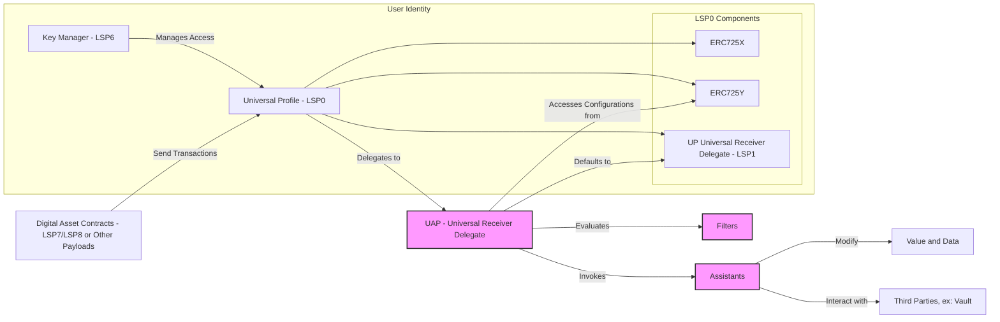

# Architecture

```mermaid
graph LR

subgraph User Identity
    UP[Universal Profile - LSP0]
    subgraph LSP0 Components
        ERC725X
        ERC725Y
        LSP1[UP Universal Receiver Delegate - LSP1]
    end
    UP --> ERC725X
    UP --> ERC725Y
    UP --> LSP1
    KM[Key Manager - LSP6] -->|Manages Access| UP
end

Tokens[Digital Asset Contracts - LSP7/LSP8 or Other Payloads] -->|Send Transactions| UP

UP -->|Delegates to| URDuap[UAP - Universal Receiver Delegate]

URDuap -->|Accesses Configurations from| ERC725Y

URDuap -->|Evaluates| Filters

URDuap -->|Invokes| Assistants

Assistants -->|Modify| Value_and_Data[Value and Data]

Assistants -->|Interact with| ThirdParties[Third Parties, ex: Vault]

URDuap -->|Defaults to| LSP1

%% Style Definitions
classDef uapClass fill:#f9f,stroke:#333,stroke-width:2px;

%% Apply Styles to UAP Components
class URDuap uapClass
class Filters uapClass
class Assistants uapClass

```
