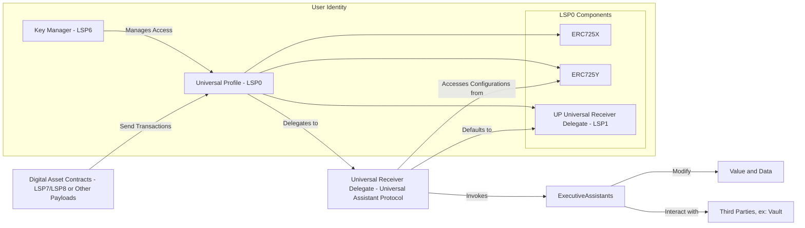

# Architecture

### Detailed Component Descriptions and Interactions

#### 1. LUKSO Universal Profile (UP) - LSP0

**Components:**

* **ERC725X**: Allows executing generic function calls.
* **ERC725Y**: Provides a key-value data store for arbitrary data.
* **Universal Receiver Delegate (LSP1)**: Handles incoming transactions and messages.

**Role:**

* Acts as the user’s on-chain identity.
* Stores configurations and preferences via the ERC725Y key-value store.
* Delegates transaction handling to a Universal Receiver Delegate.

**Interactions:**

* **Receives transactions** from digital asset contracts (e.g., LSP7 or LSP8).
* **Delegates incoming transactions** to the Universal Assistant Protocol's Universal Receiver Delegate (`URDuap`).
* **Access controlled** by the Key Manager (KM).

***

#### 2. Key Manager (KM) - LSP6

**Role:**

* Manages permissions and access control for the UP.

**Responsibilities:**

* Determines who can modify the UP’s data and configurations.
* Ensures only authorized entities can interact with sensitive functions.

**Interactions:**

* Manages access to the UP (ERC725X, ERC725Y).
* Enforces permission checks for data updates or contract calls.

***

#### 3. Digital Asset Contracts - LSP7/LSP8

**Role:**

* Represent fungible (LSP7) or non-fungible (LSP8) tokens within the LUKSO ecosystem.

**Interactions:**

* Send transactions (e.g., token transfers) to the UP.
* Trigger the Universal Receiver Delegate upon asset transfer or interaction.

***

#### 4. Universal Receiver Delegate for Universal Assistant Protocol (URDuap)

**Role:**

* The Universal Assistant Protocol’s specialized Universal Receiver Delegate that handles incoming transactions.

**Responsibilities:**

* Receives `typeId` and `data` from the UP.
* Looks up any **Executive Assistants** configured under that `typeId`.
* Calls each **Executive Assistant** in order, passing them the current `value` and `data`.
* Executes the returned operations (on behalf of the UP) via `IERC725X.execute(...)`.
* **Falls back** to the default LSP1 delegate behavior if no Assistants are found.

**Interactions:**

* **Delegated to by the UP**: Receives all inbound calls from the UP.
* **Accesses ERC725Y**: Reads user-defined config for each `typeId`.
* **Invokes Executive Assistants**: Calls their `execute(...)` function in sequence.
* **Updates `value` and `data`**: Receives possibly updated values from each Assistant.
* **Defaults to LSP1**: If no relevant Assistants are configured or none are invoked.

***

#### 5. ERC725Y Data Store

**Role:**

* Key-value store within the UP for configuration and user preferences.

**Responsibilities:**

* Maps `typeId` to an ordered list of **Executive Assistant** contract addresses.
* May also store per-Assistant settings used when the Assistant is invoked.
* Accessible by `URDuap` to retrieve necessary data.

**Interactions:**

* Queried by `URDuap` for the list of Assistants mapped to a given `typeId`.
* Manages data keys such as:
  * `UAPTypeConfig:<typeId>` → Encoded addresses of the Executive Assistants.
  * `UAPExecutiveConfig:<assistantAddress>` → Custom assistant settings.

***

#### 6. Executive Assistants

**Role:**

* Modular contracts that implement specific logic to handle transactions.

**Responsibilities:**

* Must implement the `execute(...)` function (see `IExecutiveAssistant` in the code).
* Process transaction data and optionally alter the `value` and `data` that flow to subsequent Assistants.
* Return an operation to be executed (if needed) via `IERC725X.execute(...)`.

**Interactions:**

* Called in sequence by `URDuap`.
* Receive the current `value` and `data`.
* Return updates to `value` and `data`, plus instructions for an on-chain operation.
* May interact with external contracts (e.g., Vaults, token registries, etc.).

***

#### 7. (Planned) Screener Assistants

**Role:**

* **Future Feature**:
* Will intercept incoming transactions/data to decide if any Executive Assistants should be invoked or if the transaction should be rejected/modified beforehand.

**Responsibilities:**

* (TBD) Could hold evaluation logic to allow or deny transaction flow.
* Potentially attach additional instructions or modifications prior to any Executive Assistant call.

**Interactions:**

* (TBD) Will be triggered by `URDuap` before normal Executive Assistant invocation.
* Will store their logic and configurations in the UP’s ERC725Y storage.

> **Note**: The Screener Assistant architecture is still under development and is **not** included in this release.

***

#### 8. Default Universal Receiver Delegate (LSP1)

**Role:**

* The standard fallback Universal Receiver Delegate in the UP.

**Responsibilities:**

* Provides a default handling mechanism for incoming transactions.
* Invoked by `URDuap` if no custom logic or Assistants are configured for a specific `typeId`.

**Interactions:**

* Performs standard actions if no UAP-specific configuration is present.
