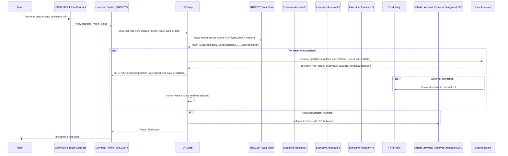

# Transaction flow

## Detailed Universal Assistant Protocol Transaction Flow

***

#### **Flow Explanation**

1. **User Initiates Transaction:**
   * A **User** sends a transaction to a **Universal Profile (UP)** (i.e. interacts with an LSP7/LSP8 token contract to transfer tokens).
   * The **token contract** calls the UP’s Universal Receiver function with `typeId` and `data`.
2. **UP Delegates to `URDuap`:**
   * The **UP** forwards the call to the **URDuap** (`universalReceiverDelegate(...)`).
3. **`URDuap` Fetches Executive Assistants:**
   * **URDuap** reads from the **ERC725Y** data store using a key like `UAPTypeConfig:<typeId>`.
   * This key contains an encoded list of Executive Assistant addresses.
4. **`URDuap` Invokes Each Executive Assistant:**
   * For each Executive Assistant in the list, **URDuap** calls `execute(...)` within the same transaction context.
   * The Assistant returns operation instructions (e.g., `IERC725X.execute(...)`) plus possibly updated `value` and `data`.
   * **URDuap** then executes those instructions on the UP’s behalf.
   * This may include external interactions with third-party contracts.
5. **Fallback to LSP1:**
   * If no Executive Assistants are configured or none are invoked, **URDuap** calls the default LSP1 delegate.
   * Finally, **URDuap** returns control to the UP, completing the transaction.

***

